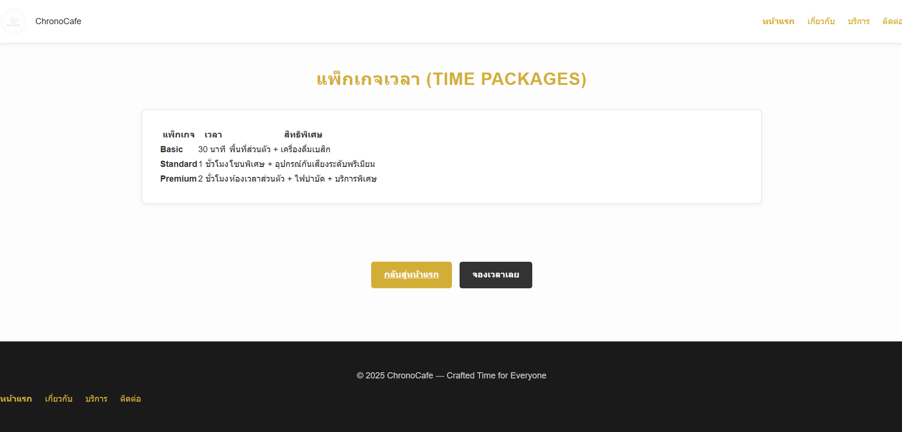

# ChronoCafe — Pure White Minimal Website

เว็บไซต์จำลองสำหรับธุรกิจ ChronoCafe คาเฟ่แนวมินิมอลญี่ปุ่นที่ “ขายเวลา” แทนการขายกาแฟ

---

## โครงสร้างไฟล์ (File Structure)

my-business-web  
├── index.html  
├── about.html  
├── services.html  
├── contact.html  
├── images/  
│ ├── about1.png  
│ ├── about2.png  
│ ├── contact.png  
│ └── ...  
└── README.md

---

## 1. หน้าแรก — `index.html`

### หน้าเว็บ

## 

## 2. หน้าเกี่ยวกับบริษัท — `about.html`

### หน้าเว็บ

---

## 3. หน้าบริการ — `services.html`

### หน้าเว็บ

---

## 4. หน้าติดต่อ — `contact.html`

---

## ลิงก์ไปยังหน้าเว็บต่าง ๆ

- <a href="http://127.0.0.1:5500/index.html">หน้าแรก</a>
- <a href="http://127.0.0.1:5500/about.html">เกี่ยวกับเรา</a>
- <a href="http://127.0.0.1:5500/services.html">บริการ</a>
- <a href="http://127.0.0.1:5500/contact.html">ติดต่อเรา</a>

---

## รายละเอียดการปรับปรุงด้วย CSS (CSS Improvements)

ใน Assignment นี้ ผมได้ทำการพัฒนาสไตล์ของเว็บไซต์ **ChronoCafe** โดยเน้นโครงสร้างที่ถูกต้องตามหลัก Semantic HTML และการออกแบบที่ทันสมัย (Modern Design) ดังนี้:

### 1. การจัดการโครงสร้างพื้นฐาน (Fundamentals)

- **Universal Reset:** ใช้ `* { box-sizing: border-box; }` เพื่อให้การคำนวณขนาด Padding และ Border ไม่กระทบต่อขนาดกล่อง
- **Typography:** เลือกใช้ Google Fonts และกำหนดลำดับความสำคัญ (Hierarchy) ของ `h1` ถึง `h4` พร้อมตั้งค่า `line-height: 1.8` เพื่อให้อ่านง่ายขึ้น

### 2. ระบบเลย์เอาต์ (Layout & Positioning)

- **Flexbox:** ใช้จัดการแถบเมนู (Navigation) และการเรียงตัวของ Service Cards ให้จัดวางกึ่งกลางอย่างสวยงาม
- **CSS Grid:** ใช้ในหน้า `about.html` สำหรับส่วนของ "ทีมงาน" เพื่อให้รูปภาพเรียงตัวกันเป็นตารางที่ยืดหยุ่น (Responsive Grid)
- **Sticky Header:** กำหนดให้ส่วนหัวของเว็บ (`#header`) ติดอยู่ที่ขอบบนตลอดเวลาขณะ Scroll เพื่อความสะดวกในการใช้งาน

### 3. ส่วนประกอบและการโต้ตอบ (Components & Interaction)

- **Reusable Classes:** สร้างคลาส `.card` สำหรับแสดงผลบริการ และ `.btn` สำหรับปุ่มกด เพื่อให้นำไปใช้ซ้ำได้ทั่วทั้งเว็บ
- **Hover Effects:** เพิ่ม `transition` และ `transform: translateY()` เพื่อให้ปุ่มและการ์ดมีการเคลื่อนไหว (Animation) เมื่อนำเมาส์ไปชี้

### 4. การออกแบบที่รองรับทุกหน้าจอ (Responsive Design)

- **Relative Units:** เปลี่ยนมาใช้หน่วย `rem` และ `em` แทน `px` ในส่วนของข้อความและระยะห่าง
- **Media Queries:** ใช้ `@media` เพื่อปรับปรุงการแสดงผลบนสมาร์ทโฟน โดยการเปลี่ยนขนาดฟอนต์และการเรียงตัวของเลย์เอาต์ให้เหมาะสม

---

## Screenshot

### index.html

### about.html

### service.html

### contact.html

---

## จัดทำโดย

### นาย นพวรินทร์ สายฟ้า 67160399 ITDI
