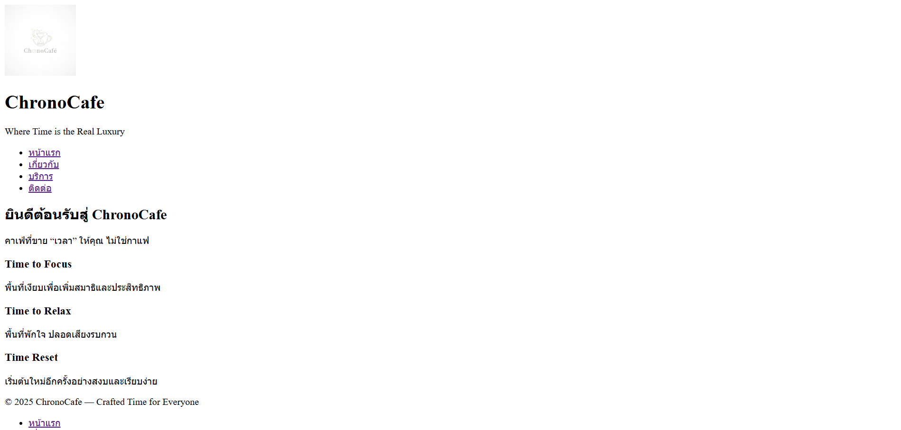
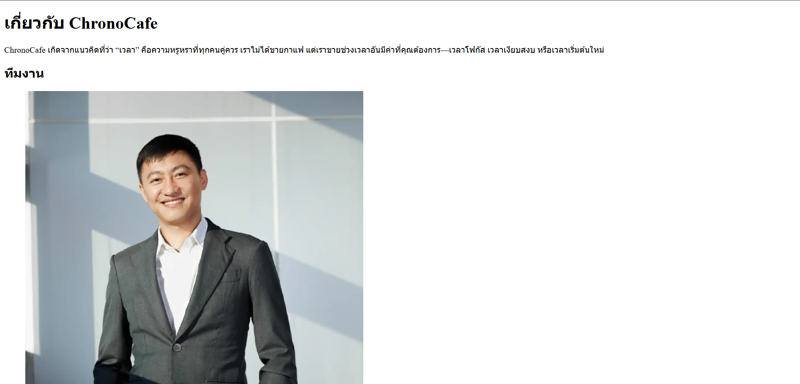
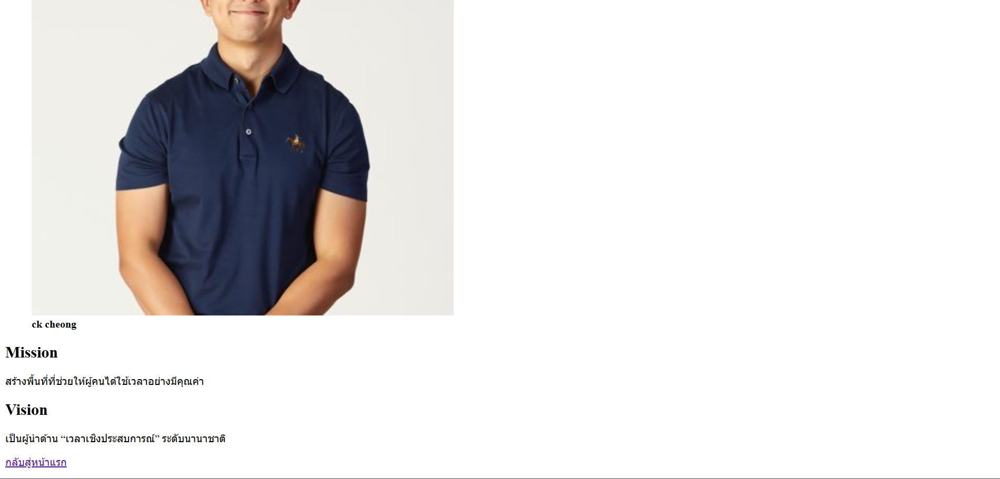
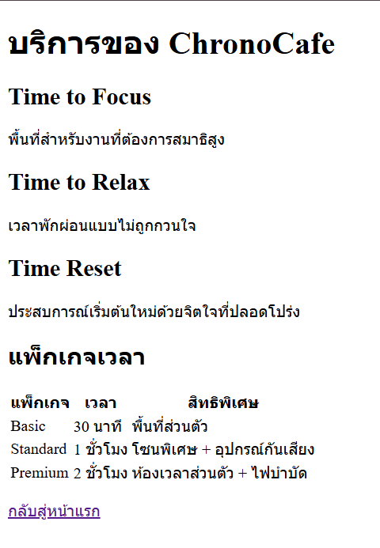
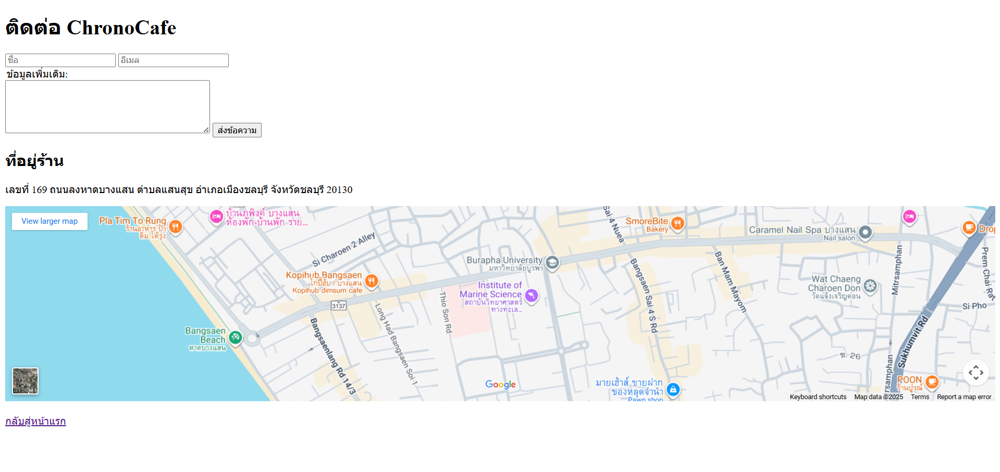

# ChronoCafe — Pure White Minimal Website

เว็บไซต์จำลองสำหรับธุรกิจ ChronoCafe คาเฟ่แนวมินิมอลญี่ปุ่นที่ “ขายเวลา” แทนการขายกาแฟ

---

## โครงสร้างไฟล์ (File Structure)

my-business-web  
├── index.html  
├── about.html  
├── services.html  
├── contact.html  
├── images/  
│ ├── logo.png  
│ ├── team-1.jpg  
│ ├── team-2.jpg  
│ └── ...  
└── README.md

---

## 1. หน้าแรก — `index.html`

### หน้าเว็บ

## 

## 2. หน้าเกี่ยวกับบริษัท — `about.html`

### หน้าเว็บ

---

## 3. หน้าบริการ — `services.html`

### หน้าเว็บ

---

## 4. หน้าติดต่อ — `contact.html`

---

## ลิงก์ไปยังหน้าเว็บต่าง ๆ

- <a href="http://127.0.0.1:5500/index.html">หน้าแรก</a>
- <a href="http://127.0.0.1:5500/about.html">เกี่ยวกับเรา</a>
- <a href="http://127.0.0.1:5500/services.html">บริการ</a>
- <a href="http://127.0.0.1:5500/contact.html">ติดต่อเรา</a>

---
